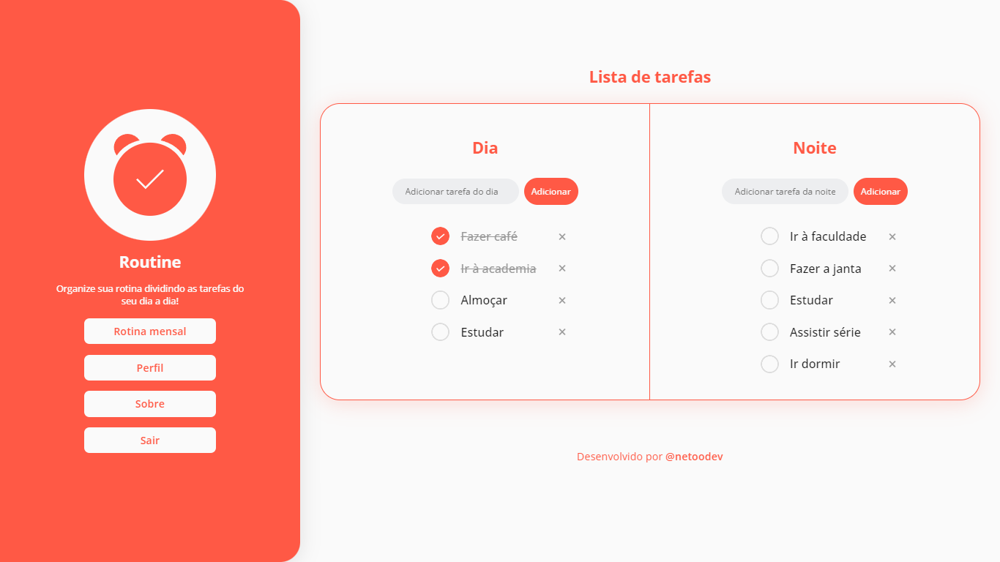
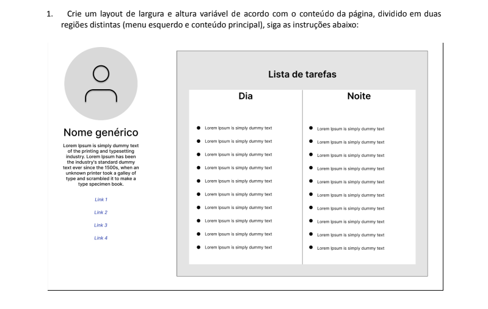

# Routine - Organize sua rotina ⏰

## ℹ️ Sobre o Routine

O [Routine](https://netoodev-routine.vercel.app/) é resultado de um desafio da Aceleradora Ágil em criar um layout de uma lista de tarefas.

## 🎯  Objetivo

O objetivo era criar um layout em HTML e CSS que correspondesse ao exemplo dado pela Aceleradora e cumprisse com os requisitos documentados.

Além disso, como um "bônus", eles acrescentaram ao desafio a estilização do layout e a dinamicidade das funcionalidade de adicionar ou remover tarefas.

## ⚙️ Funcionalidades

No Routine você pode dividir as tarefas do seu dia em dois turnos.

O site conta com:

- Adição de tarefas;
- Conclusão de tarefas;
- Remoção de tarefas;
- Divisão de turno.

## 🖥️ Tecnologias utilizada

Para esse projeto, utilizei: 

- HTML;
- CSS;
- JavaScript.

## 👀 Visualização

Você pode conferir o Routine [clicando aqui](https://netoodev-routine.vercel.app/) ou através do link: https://netoodev-routine.vercel.app/

⚠️ (AINDA NÃO RESPONSIVO)

Espero que gostem! ⏰🧡